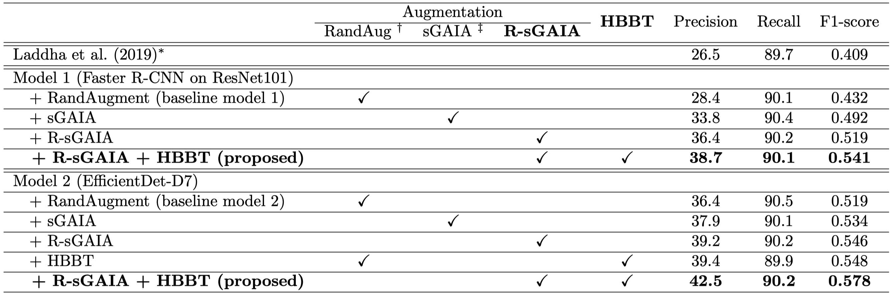
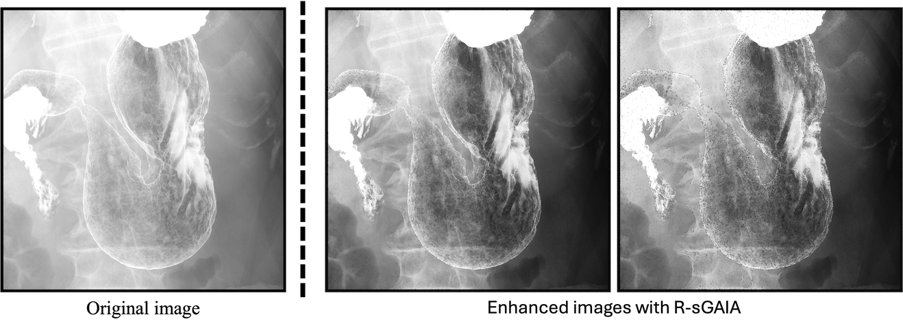

## Implementation of the paper: Practical X-ray Gastric Cancer Screening Using Refined Stochastic Data Augmentation and Hard Boundary Box Training
Hideaki Okamoto, Quan Huu Cap, Takakiyo Nomura, Kazuhito Nabeshima, Jun Hashimoto, Hitoshi Iyatomi<br>

Paper: https://arxiv.org/abs/2108.08158<br>

**Abstract**: *Endoscopy is widely used to diagnose gastric cancer and has a high diagnostic performance, but it must be performed by a physician, which limits the number of people who can be diagnosed. In contrast, gastric X-rays can be performed by technicians and screen a much larger number of patients, but accurate diagnosis requires experience. We propose an unprecedented and practical gastric cancer diagnosis support system for gastric X-ray images, enabling more people to be screened. The system is based on a general deep learning-based object detection model and incorporates two novel techniques: refined probabilistic stomach image augmentation (R-sGAIA) and hard boundary box training (HBBT). R-sGAIA enhances the probabilistic gastric fold region, providing more learning patterns for cancer detection models. HBBT is an efficient training method that improves model performance by allowing the use of unannotated negative (i.e., healthy control) samples, which are typically unusable in conventional detection models. The proposed system achieves a sensitivity (SE) for gastric cancer of 90.2%, higher than that of an expert (85.5%). Additionally, two out of five detected candidate boxes are cancerous, maintaining high precision while processing images at a speed of 0.51 seconds per image. The system also outperforms methods using the same object detection model and state-of-the-art data augmentation, showing a 5.9-point improvement in the F1 score. In summary, this system efficiently identifies areas for radiologists to examine within a practical timeframe, significantly reducing their workload.*



## Refined probabilistic stomach image augmentation (R-sGAIA)
R-sGAIA is a probabilistic gastric fold region enhancement method used to provide more learning patterns for cancer detection models. 
R-sGAIA generates various images that highlight gastric folds in X-ray images, using medical knowledge to detect inflammation on the gastric mucosal surface. 


Please see the [R_sGAIA.py](R_sGAIA.py) for the detailed implementation. 

**<u>Disclaimer</u>**: This re-implementation is slightly different from the paper due to unforeseen circumstances. The results obtained may vary from those described in the paper. 

We provide the R-sGAIA as a function as follows: 
```python
import cv2
from R_sGAIA import R_sGAIA

img_path = "/path/to/gastric_cancer_image.jpg"
enhanced_gastric_img = R_sGAIA(img_path)

# save image to disk if needed
cv2.imwrite("enhanced_gastric.jpg", enhanced_gastric_img*255.)
```

## Hard boundary box training (HBBT)
HBBT is an efficient and versatile training method for common object detection models that allows the use of unannotated negative (i.e., healthy control) samples that otherwise cannot be used for training in conventional detection models. 
This reduces false positives and thus improves overall performance. 
HBBT is a generic learning method that can be applied to any of the recent machine learning based object detection models using boundary boxes. 

**<u>Disclaimer</u>**:  The HBBT code published here is applied to a newer object detection model (YOLOv8) than the model  presented in the original paper (EfficientDet). Therefore, please note that the results obtained may vary from those described in the paper.

### Step 1: Train detection model
The prerequisite to using HBBT is to train an object detection model. Training code using YOLOv8 can be found in [train_yolov8.py](yolov8/train_yolov8.py).  
To train your own model
```bash
cd yolov8

python train_yolov8.py --config configs/exp_conf.yaml --name cancer_gastric_detection \
--batch 32 --device 0,1,2,3 --epoch 100
```

After training, to get the predicted boxes
```python
from ultralytics import YOLO

ckpt_path = "/path/to/your/model"
# load YOLOv8 model
model = YOLO(ckpt_path)
# run inference on the image
image_path = "/path/to/test/image.jpg"
conf = 0.25
iou = 0.7
imgsz = 1472

results = model(
  source=image_path, 
  conf=conf, 
  iou=iou, 
  imgsz=imgsz
)

# get the predicted boxes in YOLO format: [x_c, y_c, w, h]
pred_boxes = results[0].boxes.xywhn
```
The inference code can be found in [inference_yolov8.py](yolov8/inference_yolov8.py)

### Step 2: Get hard boundary boxes
Given a list of predicted and ground-truth bounding boxes, hard boundary boxes can be obtained as follows:
```python
from HBBT import get_hard_boundary_boxes

# ground-truth boxes in YOLO format ([x_c, y_c, w, h])
gt_boxes = [
  [0.2038, 0.2038, 0.2717, 0.2717], 
  [0.7133, 0.8391, 0.2038, 0.3193],
]

# predicted boxes in YOLO format ([x_c, y_c, w, h])
pred_boxes = [
  [0.2072, 0.2014, 0.2921, 0.2629],
  [0.7531, 0.5353, 0.1474, 0.4429],
  [0.7075, 0.8346, 0.2072, 0.3201],
  [0.6793, 0.8492, 0.6793, 0.3397],
  [0.1325, 0.2344, 0.1427, 0.3465],
]

hard_pred_boxes = get_hard_boundary_boxes(gt_boxes=gt_boxes, pred_boxes=pred_boxes, iou_thr=0.5)
print(hard_pred_boxes)

# save hard boundary boxes in YOLO format
hard_sample_class_id = 1 # suppose gastric class ID is 0

with open("yolo_label_sample.txt", "w") as f:
  for bbox in hard_pred_boxes:
    row_data = [hard_sample_class_id] + bbox
    row_str = " ".join([str(x) for x in row_data])
    
    f.write(f"{row_str}\n")
```

Finally, these hard-sample labels will be used to re-train the detection model.

## Citation

```
@article{okamoto2024gastric,
  title   = {Practical X-ray Gastric Cancer Screening Using Refined Stochastic Data Augmentation and Hard Boundary Box Training},
  author  = {Hideaki Okamoto and Quan Huu Cap, Takakiyo Nomura and Kazuhito Nabeshima and Jun Hashimoto and Hitoshi Iyatomi},
  journal = {arXiv preprint},
  year    = {2024}
}
```